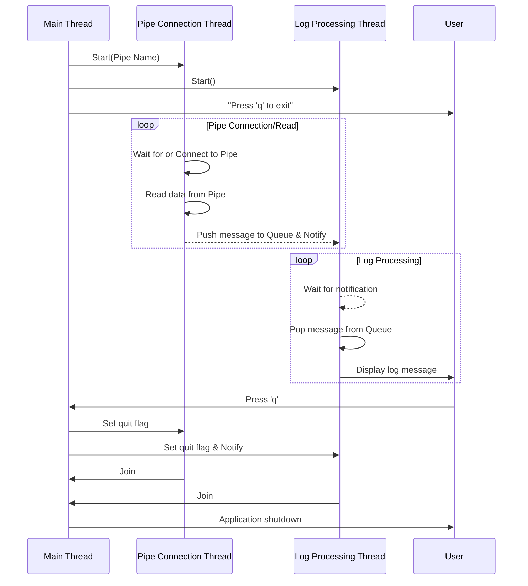

# LogConsumer

`LogConsumer`는 Windows 환경에서 명명된 파이프(Named Pipe)를 통해 로그 메시지를 수신하고 처리하는 C++ 콘솔 애플리케이션입니다. 이 프로그램은 별도의 스레드에서 파이프 연결 및 데이터 수신을 처리하고, 다른 스레드에서 수신된 로그를 처리하여 콘솔에 출력합니다.

## 주요 기능

-   **다중 스레딩**: 파이프 연결/수신 스레드와 로그 처리 스레드를 분리하여 비동기적으로 작업을 수행합니다.
-   **명명된 파이프 통신**: `\\.\pipe\MySerial_<mode>_<Port>` 형식의 명명된 파이프를 사용하여 외부 프로세스(Producer)로부터 데이터를 수신합니다.
-   **안전한 종료**: 사용자가 'q' 키를 누르면 모든 스레드가 안전하게 종료됩니다.

## 아키텍처

프로그램의 데이터 흐름은 다음과 같습니다.

```
[외부 Producer] ---> [Windows Named Pipe] ---> [LogConsumer]
                                                 |
                                                 +--> [Pipe Connection Thread] (데이터 수신)
                                                 |
                                                 +--> [Thread-Safe Queue] (메시지 저장)
                                                 |
                                                 +--> [Log Processing Thread] (콘솔 출력)
```

## UML Sequence Diagram

아래는 프로그램 내부의 스레드 간 상호작용을 나타내는 시퀀스 다이어그램입니다.



## 빌드 방법

이 프로젝트는 CMake를 사용하여 빌드합니다. Visual Studio 2022 개발자 환경이 필요합니다.

1.  **저장소 복제 (Clone the repository)**
    ```bash
    # 이 프로젝트를 클론했다고 가정합니다.
    # git clone <repository_url>
    cd MyIperf_Pipe
    ```

2.  **빌드 디렉토리 생성 및 CMake 실행**
    ```bash
    # 'build' 디렉토리가 있다면 삭제하여 새로 구성합니다.
    if (Test-Path -Path build) { Remove-Item -Recurse -Force build }
    mkdir build
    cd build
    
    # CMake를 사용하여 Visual Studio 솔루션 파일을 생성합니다.
    cmake ..
    ```

3.  **컴파일**
    CMake가 생성한 `LogConsumer.sln` 파일을 Visual Studio에서 열어 빌드하거나, 아래 명령어를 사용하여 커맨드 라인에서 직접 빌드할 수 있습니다.

    ```bash
    # Debug 빌드
    cmake --build . --config Debug

    # Release 빌드
    cmake --build . --config Release
    ```
    빌드가 완료되면 `build\Debug` 또는 `build\Release` 디렉토리에 `consumer.exe` 파일이 생성됩니다.

## 실행 방법

프로그램을 실행하려면 2개의 인자 `<mode>`와 `<Port>`가 필요합니다. 이 인자들은 연결할 명명된 파이프의 이름을 결정하는 데 사용됩니다.

**사용법:**
```
consumer.exe <mode> <Port>
```

-   `<mode>`: 파이프 이름을 구성하는 데 사용될 모드 (예: `client`, `server` 등)
-   `<Port>`: 파이프 이름을 구성하는 데 사용될 포트 번호

**실행 예시:**
`client` 모드와 `COM3` 포트를 사용하는 명명된 파이프(`\\.\pipe\MySerial_client_COM3`)에 연결하려면 다음과 같이 실행합니다.

```bash
# build/Debug 디렉토리로 이동
cd build/Debug

# 프로그램 실행
./consumer.exe client COM3
```

이제 다른 프로세스에서 해당 명명된 파이프로 데이터를 전송하면 `LogConsumer` 콘솔에 로그가 출력됩니다. 프로그램을 종료하려면 콘솔에서 `q` 키를 누르세요.
